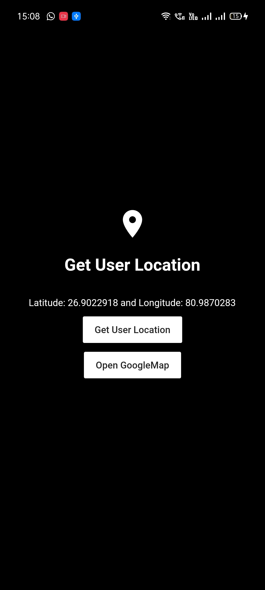
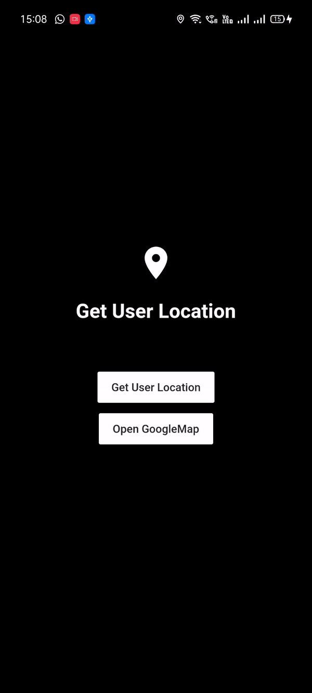

# userlocation-flutter
Get User Current Location (Latitude and Longitude) and Open it in GoogleMaps

  
    

 

Happy Learning 👍

 
 
Subscribe Now! <a href="https://www.youtube.com/channel/UCknAgO0AdG61Yd1G7D1Arxg">BackSlash Flutter YouTube Channel</a>
Show some :heart: and star the repo to support the project

   

<h3>Stay Healthy!✨Stay Safe!🖖</h3>
 
